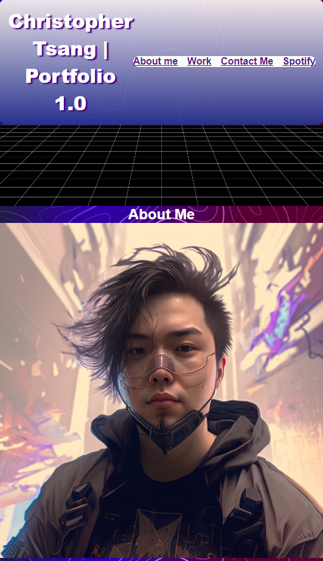

# Challenge-02

## Description
Creating Portfolio attempt 1.0

## Usage

Created live portfolio for recruiting purposes

GitHub Repo: https://github.com/wontonchris/challenge-02
Live Site: https://wontonchris.github.io/challenge-02/



## User Story

```
AS A Full Stack Engineer
I WANT a portfolio with user information
SO THAT business/companies can be directed to see my work.
```

## Acceptance Criteria

```
GIVEN a webpage meets accessibility standards
WHEN I view the source code

```